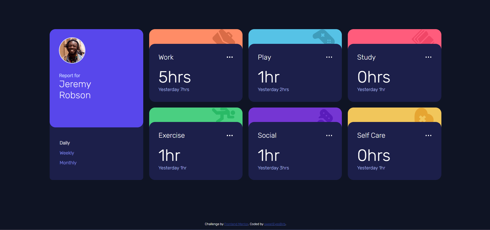

# Frontend Mentor - Time tracking dashboard solution

This is a solution to the [Time tracking dashboard challenge on Frontend Mentor](https://www.frontendmentor.io/challenges/time-tracking-dashboard-UIQ7167Jw). Frontend Mentor challenges help you improve your coding skills by building realistic projects. 

## Table of contents

  - [The challenge](#the-challenge)
  - [Screenshot](#screenshot)
  - [Links](#links)
  - [My process](#my-process)
  - [Built with](#built-with)
  - [What I learned](#what-i-learned)
  - [Continued development](#continued-development)
  - [Useful resources](#useful-resources)
  - [Author](#author)
  - [Acknowledgments](#acknowledgments)


### The challenge

Users should be able to:

- View the optimal layout for the site depending on their device's screen size
- See hover states for all interactive elements on the page
- Switch between viewing Daily, Weekly, and Monthly stats


### Screenshot




### Links

- Solution URL: [Add solution URL here](https://github.com/SweetEyesBirb/time-tracking-dashboard-main)
- Live Site URL: [Add live site URL here](https://your-live-site-url.com)


## My process

- Design a solution for the HTML part
- Style the HTML with CSS
- Test the layouts with different screen sizes and adjust.
- Implement JS
- Test the whole thing
- Refactor
- Do more testing
- Write more notes if necessary
- Proof reading
- Commit


### Built with

- Semantic HTML5 markup
- CSS custom properties
- Flexbox
- CSS Grid
- Mobile-first workflow                                             (no, but easy to swap CSS)
- [React](https://reactjs.org/) - JS library                        (no, but keeping this line for reference)
- [Next.js](https://nextjs.org/) - React framework                  (no, but keeping this line for reference)
- [Styled Components](https://styled-components.com/) - For styles  (no, but keeping this line for reference)


### What I learned

Use this section to recap over some of your major learnings while working through this project. Writing these out and providing code samples of areas you want to highlight is a great way to reinforce your own knowledge.

I have learned a lot through this challenge.
- One of the first things that I have learned is ``` box-sizing: border-box; ``` and how it works with the elements.
- I have learned that CSS Grid elements do not like width and height as these properties can affect the positioning and gappig of the grid.
- Properties like ``` display: flex ``` or ``` display: grid ``` or else have o be declaired on the parent as well as others like ``` justify-content ``` if needed.
- Element positioning like "relative" for instance, affects the behaviour of the child. For example, "absolute" positioning in a "relative" parent would cause the child be positioned absolutely relatively to the parent.
- Some properties like ``` top, bottom, right etc ``` do not work if the element is in a "static" position.

- ``` body { display: none; } ``` is a good trick to use with media queries in CSS when you want to have a direct feedback on where the breakpoint is.
- Setting the "width" of an img container instead of just adjusting the img size helps preventing the image from resizing.
- The "z-index" preperty is a way to layer HTML elements over each other and to tell who has priority. The higher the z-index, the more the element goes on the top of other elements.
- Background images apparently are advised to be set using the ``` background-image ``` property rather that an "img" element in the HTML.
- ``` align-items ``` aligns items vertically.
- Sometimes if some elements do not have a "hight" property set, they can behave oddly.
- In HTML containerize groups of elements as much as possible (no over diddly doodling). This helps alignment when using "flexbox".
- In JavaScript, you cannot have one file for all the HTML pages. If one HTML element is living only in one of the html files, as soon as you start implementing code for the other page with the page open, JS will throw errors. All variables that point to HTML elements must exist within the linked and opened HTML page.
- Accessing complex JSON objects can be pretty challenging.
- How do you comment JUST a selection in VScode in HTML? The world keeps saying ``` Ctrl + K Ctrl + C ``` but only the secret keepers of knowledge know the secret keyboard shortcut. Rumors has it that the shortcut is safely guarded in the depths of our beloved satellite.


``` JavaScript
fetch("url")
    .then(response => response.json())
    .then(data => {
          console.log(data); 
        })
        .catch(error => {
            console.error(error);
        })
```

If you want more help with writing markdown, we'd recommend checking out [The Markdown Guide](https://www.markdownguide.org/) to learn more.


### Continued development

Building responsive and accessible websites is definitely something that I should keep at it. HTML, CSS and vanilla JS for now are enough. Hopefully in the future I'll be able to use JS frameworks and libraries as well as SASS and who knows what.


### Useful resources

- [Resource 1](https://www.w3schools.com/)
- [Resource 2](https://developer.mozilla.org/en-US/)
- [Resource 3](https://css-tricks.com/)
- [Resource 4](https://stackoverflow.com/)
- [Resource 5](https://www.w3docs.com/)
- [Resource 5](https://www.youtube.com/@TraversyMedia)
- [Resource 6](https://www.youtube.com/@freecodecamp)


## Author

- Website - [Fab](https://github.com/SweetEyesBirb/time-tracking-dashboard-main)
- Frontend Mentor - [@SweetEyesBirb](https://www.frontendmentor.io/profile/SweetEyesBirb)


## Acknowledgments

This project was a solo work, however, many useful resources online have helped me in the completion of this challenge. I am greatful for @TraversyMedia YouTube channel as it has been extremely useful for layering the fundations of HTML and CSS providing clear, concise and chilled expanations. Without these masters who are providing free high quality lessons and tutorials (in terms of teachings), it would be exceptionally hard to pick up some speed in learning just anything.
                            
                                                                                                                    Thanks to all.